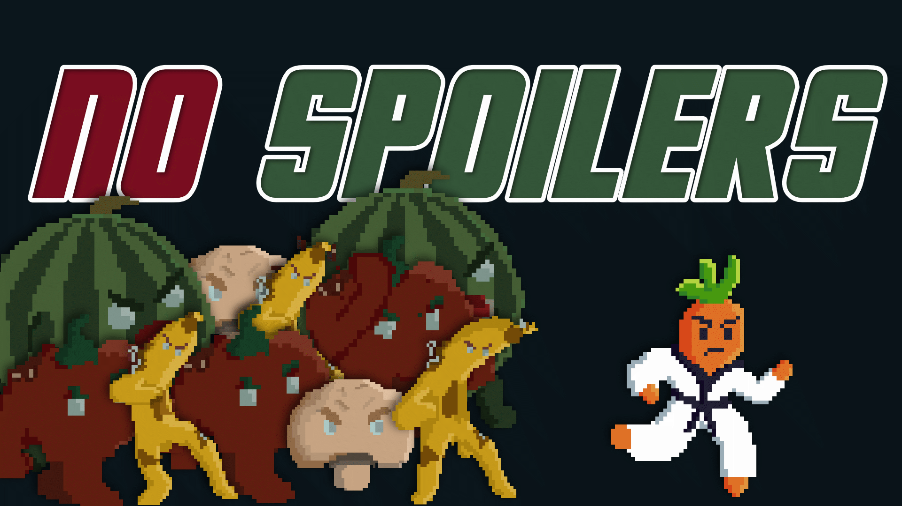

<!--
# :exclamation: READ FIRST :exclamation:
Before committing anything, set up gitignore and git LFS correctly for your project and your programming environment. When gitignore and git LFS are configured, remove this section from the readme.

# :grey_exclamation: FIRST STEPS
Please update the [game teaser image](game_teaser.jpg) and this README throughout the semester. Please don't rename, move or delete these files.
 -->

# No Spoilers!

# :video_game: Game Programming Lab 2024 - House Hyrule - Team3

No Spoilers is our game about a carrot fighting its way out of a rotting fridge, the contents of which were forgotten when its owner went on a long vacation. Times were hard already, but when the power went out everything got even worse for our brave fighting carrot!

Fight your way through progressively larger levels, trying to find the exit that leads to the next level. On your way you will have to kick all kinds of rotting fruits and veggies that used to be your friends, such as bananas, mushrooms or watermelons!

## Controls

### Keyboard

- W,A,S,D or arrow keys: Move or navigate menus
- Space: Kick
- V: Dodge/Roll
- P [While playing in a level]: Pause
- Esc at any time: Exit the game

### Gamepad

- Left Stick: Move
- DPad: Navigate Menus
- Back Button (Opposite of Start button): Exit the game
- Start Button [While playing in a level]: Pause
- Right Trigger: Kick
- Left Trigger: Dodge/Roll

Members: Simon Ebner, Laura Nydegger, Florence Kissling, Igor Martinelli, and Jonas Konrath
